# Askardex Wallet — Self-Attestation Evidence

Wallet name: `askardex-wallet`
Last updated: 2026-07-25

All tests performed on Canton Network MainNet (Splice 0.6.x, Migration ID 4).

---

## CC support `cc_support`

> Send, receive, and hold Canton Coin.
>
> Suggested test: Send CC to and from the wallet. Record the transaction update IDs and
> optionally provide screenshots of the holding, transfer, and party ID.

- Transaction update ID(s): `122022d759ba9ea73aaba82e70a5ca3ebed9ce3ab4946e4f7e526e79f953f2df6b38`
- Party ID(s): `b2a11d907944-askardex::1220bd53dd8475646097f233957b61695a91e2b5a1882e393337e321f9e89097a96f`
- Explorer link(s): https://www.cantonscan.com/update/122022d759ba9ea73aaba82e70a5ca3ebed9ce3ab4946e4f7e526e79f953f2df6b38
- Screenshot(s) / video: 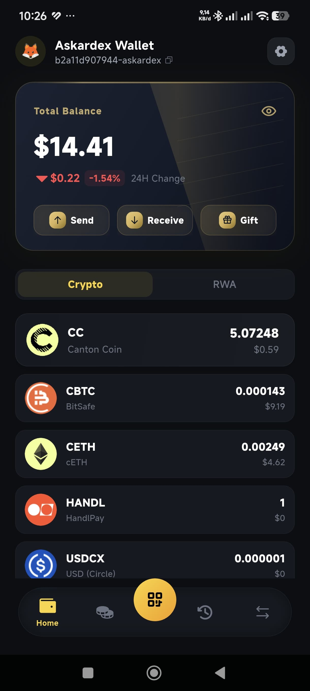 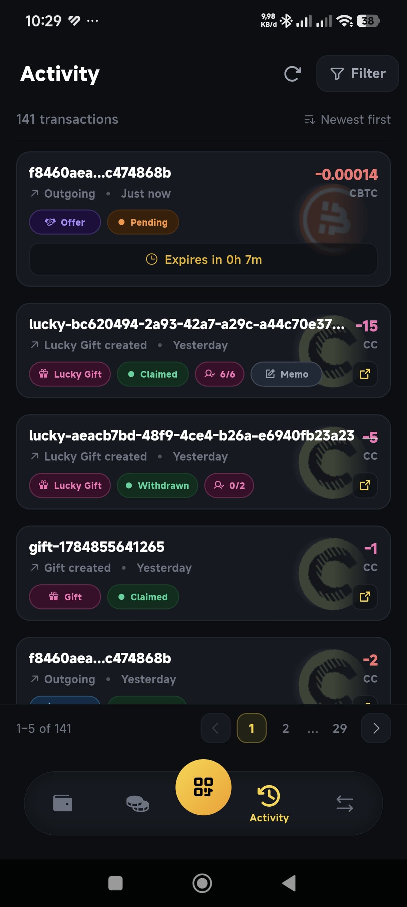
- Notes: 8.709 CC sent to Cantex (external party), 2026-07-24. Askardex Wallet is a Featured App on Canton Network MainNet.

---

## Pre-approvals for CC `preapprovals`

> Auto-accept incoming CC without manual confirmation.
>
> Suggested test: Enable pre-approvals for CC. Send CC to the wallet address. Confirm
> the transfer was auto-accepted. Record the transaction update IDs and optionally
> provide screenshots of the holding, transfer, and party ID.

- Transaction update ID(s): `122022d759ba9ea73aaba82e70a5ca3ebed9ce3ab4946e4f7e526e79f953f2df6b38`
- Party ID(s): `b2a11d907944-askardex::1220bd53dd8475646097f233957b61695a91e2b5a1882e393337e321f9e89097a96f`
- Explorer link(s): https://www.cantonscan.com/update/122022d759ba9ea73aaba82e70a5ca3ebed9ce3ab4946e4f7e526e79f953f2df6b38
- Screenshot(s) / video: 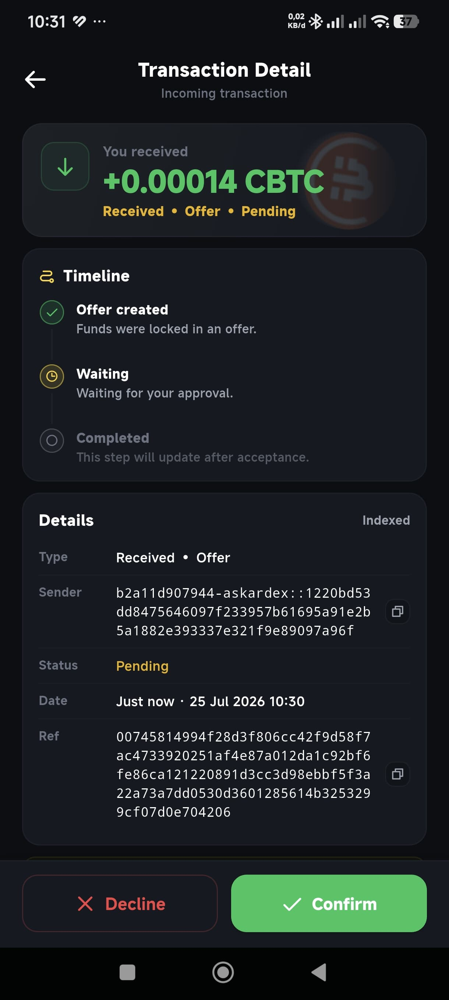
- Notes: Pre-approvals configurable per-party under Wallet Settings in the Askardex mobile app. Incoming CC transfers are auto-settled without manual confirmation when enabled.

---

## CIP-0056 token standard transfer support `cip_0056_transfer`

> Send and receive any CIP-0056 token, not just CC.
>
> Suggested test: Send a CIP-0056-compatible token (not Canton Coin) to and from the
> wallet. Record the transaction update IDs and optionally provide screenshots of the
> holding, transfer, and party ID.

Four CIP-0056 tokens tested on mainnet:

**USDCx**
- Transaction update ID(s): `122014304448d0c1c07ad2cbb5c4b0fccfff7cb0fb3ef2095d6cd6da3ec56f30a8e0`
- Explorer link(s): https://www.cantonscan.com/update/122014304448d0c1c07ad2cbb5c4b0fccfff7cb0fb3ef2095d6cd6da3ec56f30a8e0
- Notes: 1.0 USDCx transferred, 2026-07-19.

**CBTC**
- Transaction update ID(s): `1220c7a49bf822d3ceaa4c1752c8e9d7ddbc118a0470aef658e1cc4d2fb906186e38`
- Explorer link(s): https://www.cantonscan.com/update/1220c7a49bf822d3ceaa4c1752c8e9d7ddbc118a0470aef658e1cc4d2fb906186e38
- Screenshot(s) / video: 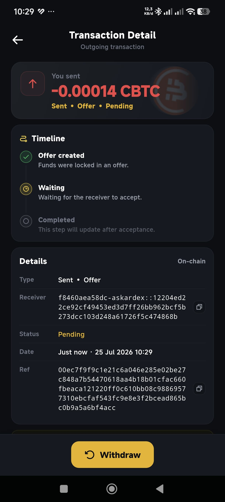 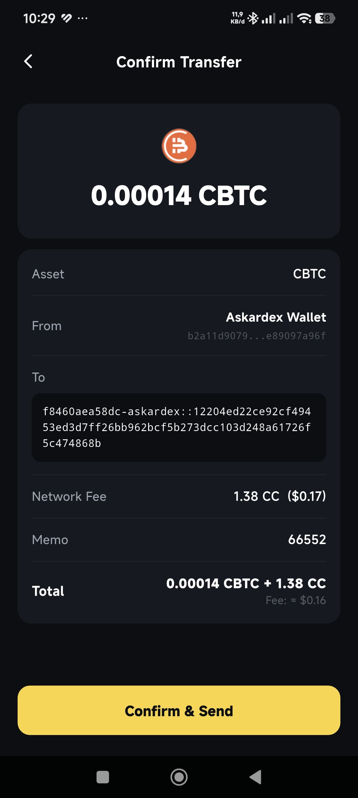
- Notes: 0.00014 CBTC transferred, 2026-06-25.

**CETH**
- Transaction update ID(s): `1220cc2bf9092c9de3dc6a9530f7df961808e8d62464641dfeb4dff99bb3ec5c18da`
- Explorer link(s): https://www.cantonscan.com/update/1220cc2bf9092c9de3dc6a9530f7df961808e8d62464641dfeb4dff99bb3ec5c18da
- Notes: 0.00249 CETH transferred, 2026-06-26.

**HANDL**
- Transaction update ID(s): `122007120f4fa68bb74c01f7593e597921b89e2831502ddaecacab57d621c0dcb2d0`
- Explorer link(s): https://www.cantonscan.com/update/122007120f4fa68bb74c01f7593e597921b89e2831502ddaecacab57d621c0dcb2d0
- Screenshot(s) / video:  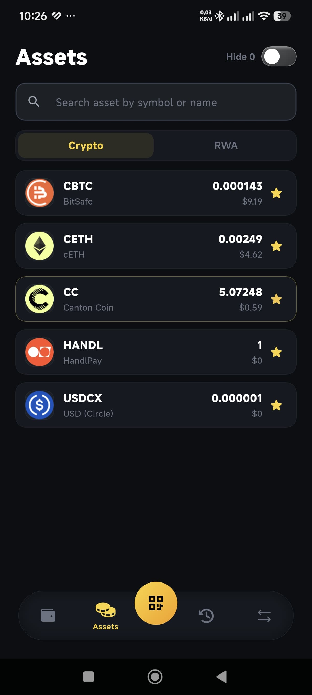
- Notes: 1.0 HANDL transferred, 2026-07-24. Homepage shows all CIP-0056 tokens held: CBTC, CETH, HANDL, USDCX.

---

## CIP-0103 dApp API support `cip_0103_dapp_api`

> Connect to and sign transactions from a third-party dApp via CIP-0103.
>
> Suggested test: Connect to a dApp using a CIP-0103 connection. Initiate a transaction
> from within the dApp and sign it from the wallet. Confirm the successful transaction.
> Optionally provide screenshots or a video recording.

- Transaction update ID(s): `122022d759ba9ea73aaba82e70a5ca3ebed9ce3ab4946e4f7e526e79f953f2df6b38`
- Party ID(s): `b2a11d907944-askardex::1220bd53dd8475646097f233957b61695a91e2b5a1882e393337e321f9e89097a96f`
- Explorer link(s): https://www.cantonscan.com/update/122022d759ba9ea73aaba82e70a5ca3ebed9ce3ab4946e4f7e526e79f953f2df6b38
- Notes: CIP-0103 relay hosted at https://api.askardex.com/api/dapp. dApp initiates a transfer request; wallet displays signing prompt and submits on-chain after user approval.

---

## Wallet Connect support `walletconnect_support`

> Connect to and sign transactions from a third-party dApp via Wallet Connect.
>
> Suggested test: Connect to a dApp using Wallet Connect. Initiate a transaction from
> within the dApp and sign it from the wallet. Confirm the successful transaction.
> Optionally provide screenshots or a video recording.

- Transaction update ID(s): `122022d759ba9ea73aaba82e70a5ca3ebed9ce3ab4946e4f7e526e79f953f2df6b38`
- Party ID(s): `b2a11d907944-askardex::1220bd53dd8475646097f233957b61695a91e2b5a1882e393337e321f9e89097a96f`
- Explorer link(s): https://www.cantonscan.com/update/122022d759ba9ea73aaba82e70a5ca3ebed9ce3ab4946e4f7e526e79f953f2df6b38
- Notes: WalletConnect v2 supported. CAIP-10 account identifier format: `canton:<synchronizer_id>//<party_id>`. Session established via QR scan from the mobile wallet.

---

## Memo tag support for transfers to omnibus accounts `memo_tag_support`

> Attach a memo tag to a transfer, recorded under the
> splice.lfdecentralizedtrust.org/reason metadata.
>
> Suggested test: Include a memo tag in an asset transfer. Record the transaction update
> ID showing the memo tag under the splice.lfdecentralizedtrust.org/reason metadata in
> the transaction JSON.

- Transaction update ID(s): `1220581555b1a11d6765fc474e59ce30999bc1e9cfed4560d1373a4d93451dfbf670`
- Party ID(s): `b2a11d907944-askardex::1220bd53dd8475646097f233957b61695a91e2b5a1882e393337e321f9e89097a96f`
- Explorer link(s): https://www.cantonscan.com/update/1220581555b1a11d6765fc474e59ce30999bc1e9cfed4560d1373a4d93451dfbf670
- Screenshot(s) / video: 
- Notes: Memo tag "bos" sent with a CC transfer, 2026-07-22. Stored under `splice.lfdecentralizedtrust.org/reason` in the on-chain transaction JSON. The confirm transfer screen shows the Memo field before signing.

---

## Reward minting `reward_minting`

> Claiming or minting a reward (e.g. a validator or app reward).
>
> Suggested test: Demonstrate the wallet claiming or minting a reward. Provide the
> transaction update ID of the reward-minting event and a screenshot of the resulting
> holding.

- Transaction update ID(s): `12205bce3e4c227fc6241981bf4b7d26812e04f3dc316053a8a09fb798430ac9f4cf`
- Party ID(s): `askardex-validator-1::1220f9c81d6050a74509010597b3c38fde6d01473f6c323c60ca8bb8b5d489bb9696`
- Explorer link(s): https://www.cantonscan.com/update/12205bce3e4c227fc6241981bf4b7d26812e04f3dc316053a8a09fb798430ac9f4cf
- Screenshot(s) / video: 
- Notes: Featured App reward coupon claimed — 19.39 CC, round 105499, 2026-07-21. Askardex is a Canton Network Featured App; the wallet displays reward amounts and on-chain update IDs in the transaction history.

---

## Clear signing `clear_signing`

> The wallet displays human-readable transaction details (not raw hex/opaque data)
> before signing.
>
> Suggested test: Show the wallet displaying human-readable transaction details before
> signing. Provide a screenshot of the clear-signing confirmation screen for a real
> transaction, alongside its transaction update ID.

Three transaction types tested — all show recipient party, amount, fee breakdown, and transaction hash before the user signs. No raw hex is shown.

**Single Gift** (3.93 CC, 2026-07-24)
- Transaction update ID(s): `12200f64bf744c4267dcd1d107eab31df48a212aec299261bd8fce6016c7a3786d1a`
- Explorer link(s): https://www.cantonscan.com/update/12200f64bf744c4267dcd1d107eab31df48a212aec299261bd8fce6016c7a3786d1a
- Screenshot(s) / video: 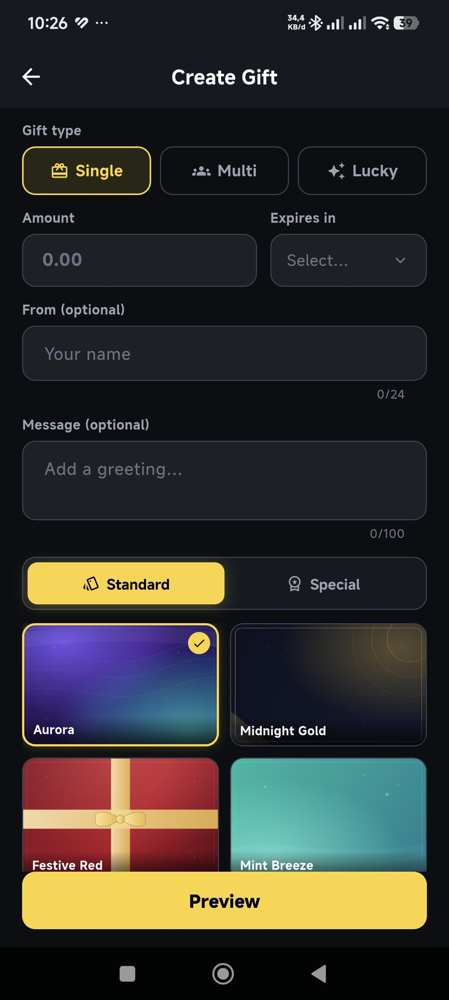 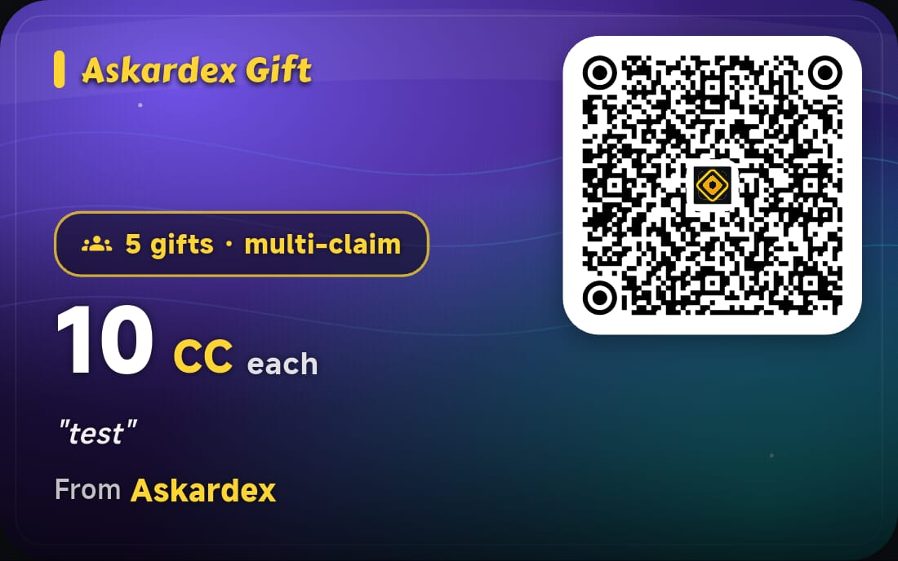

**Multi-claim Gift Pool** (2 × 1.0 CC per claim, 2026-07-24)
- Transaction update ID(s): `122088a3b96881e1c5eef7634c93521380ecab36c64919406f616112eaa077cf1e2c`
- Explorer link(s): https://www.cantonscan.com/update/122088a3b96881e1c5eef7634c93521380ecab36c64919406f616112eaa077cf1e2c
- Screenshot(s) / video: 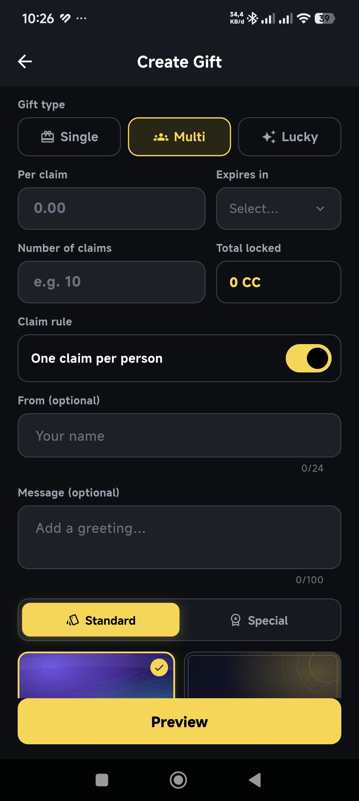

**Lucky Gift** (80 CC total: 30 × 1 CC regular + 1 × 50 CC lucky prize, 2026-07-25)
- Transaction update ID(s): `12201ef24e49439d9f7c3246e8247020d572db8386db9d6aa9174893aae30970e2a1`
- Explorer link(s): https://www.cantonscan.com/update/12201ef24e49439d9f7c3246e8247020d572db8386db9d6aa9174893aae30970e2a1
- Screenshot(s) / video: 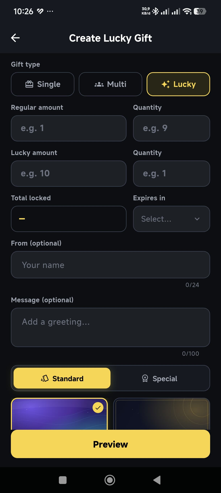 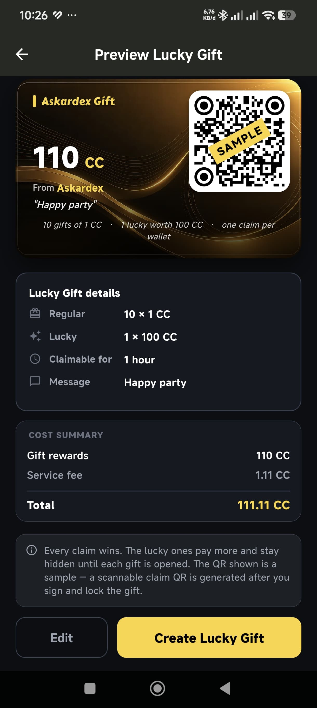
