# Blockdaemon Institutional Vault — Self-Attestation Evidence

Wallet name: `blockdaemon-institutional-vault`
Last updated: 2026-08-27

Public documentation source: [https://vault.docs.blockdaemon.com/](https://vault.docs.blockdaemon.com/)
(repo: `mothership-public-docs`)

<!-- Evidence below prefers published vault.docs pages and OpenAPI reference
entries. Live Canton update IDs, party IDs, explorer links, and screenshots
(Vault UI, ApproverApp, Canton Contract Management) go under
./blockdaemon-institutional-vault-self-attestation-images/. -->

## Evidence status

### Documented on vault.docs (linked in feature headings below)

| Feature | Primary public proof |
| --- | --- |
| `cc_support` | [Canton Coin](https://vault.docs.blockdaemon.com/docs/canton), [Make Transaction](https://vault.docs.blockdaemon.com/reference/cwpstartmaketransaction), on-chain DevNet transfer below |
| `two_step_cc_transfers` | DevNet `TransferInstruction` Accept (1 Amulet) below |
| `preapprovals` | [Canton Preapproval](https://vault.docs.blockdaemon.com/reference/cwpstartcantonpreapproval), `TransferPreapproval_SendV2` on-chain below |
| `cip_0056_transfer` | [Add CIP56 asset](https://vault.docs.blockdaemon.com/reference/addblockchainsupportedasset), TestNet USDCx transfer below |
| `cip_0056_allocation` | [Create Allocation](https://vault.docs.blockdaemon.com/reference/cwpstartcreateallocation), TestNet DvP allocate + settle below |
| `memo_tag_support` | [Make Transaction](https://vault.docs.blockdaemon.com/reference/cwpstartmaketransaction) `Canton.Reason`, on-chain DevNet transfer + Vault memo below |
| `walletconnect_support` | DA Registry WalletConnect session + Vault Canton `bd::` party screenshots below |
| `tokenization` | DevNet MintOffer + TestNet DvP; Canton Contract Management screenshots below |
| `wallet_gateway_signing_driver` | [canton-network/wallet `core/signing-blockdaemon`](https://github.com/canton-network/wallet/blob/main/core/signing-blockdaemon/README.md) |
| `clear_signing` | ApproverApp screenshots below (AllocationFactory_Allocate / USDCx) |

### Self-attested-only features (directory has no `proof:` link; docs for reviewers)

| Feature | Public docs |
| --- | --- |
| `key_recovery` | [Emergency Recovery (`ertool`)](https://vault.docs.blockdaemon.com/docs/emergency-recovery), [Create ERS key](https://vault.docs.blockdaemon.com/docs/create-ers-key) |
| `policy_workflows` | [Transaction Restrictions](https://vault.docs.blockdaemon.com/docs/transaction-restrictions) |

### Shared on-chain evidence (CC + preapproval + memo)

One Canton DevNet transfer covers `cc_support`, `preapprovals`, and `memo_tag_support`:

- Update ID: `12201036803aac784da83c291acb7fa91556a9cc2e8ed59d8e6af6c48ff96d3b4fb5`
- Explorer: https://lighthouse.devnet.cantonloop.com/transactions/12201036803aac784da83c291acb7fa91556a9cc2e8ed59d8e6af6c48ff96d3b4fb5
- Choice exercised: `TransferPreapproval_SendV2` (destination had a CC transfer preapproval; transfer auto-settled)
- Vault memo (on-chain): `cc_support preapprovals memo_tag_support`
- Amount: 2 CC (Canton/Devnet); Source account `treasuryvault1`; Destination account `payments1`
- Screenshot: 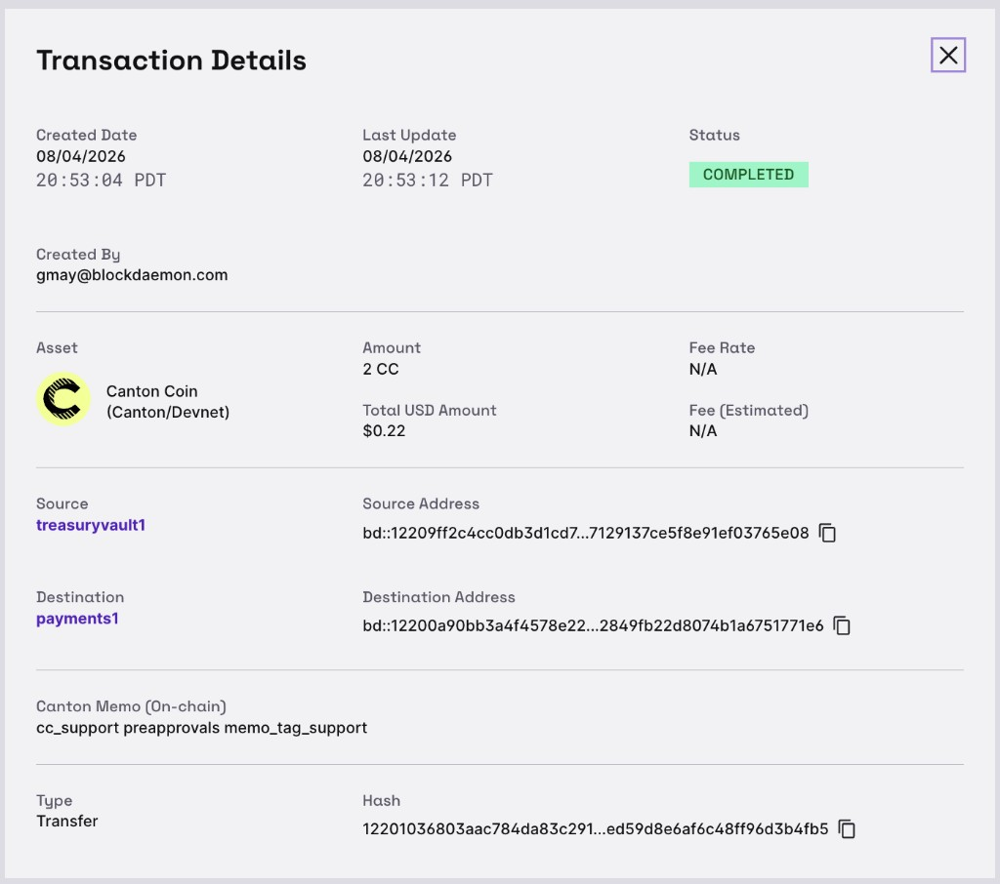

### Shared DvP / allocation evidence (CIP-0056 allocation)

Canton TestNet Tradeweb cash trade `CASH-UI-1785287227965` (instrument USDCx) via Canton Contract Management:

- Allocate update ID: `122082fea90b55c88f9a23a42fd1acbbfbd394376ff33788104976065a973580b045`
- Allocate explorer: https://lighthouse.testnet.cantonloop.com/transactions/122082fea90b55c88f9a23a42fd1acbbfbd394376ff33788104976065a973580b045
- Settle update ID: `1220d626d21a6be4920c72c0801eb483fc1559192e835f3a04bd031519d21bf081d3`
- Settle explorer: https://lighthouse.testnet.cantonloop.com/transactions/1220d626d21a6be4920c72c0801eb483fc1559192e835f3a04bd031519d21bf081d3
- Screenshots: 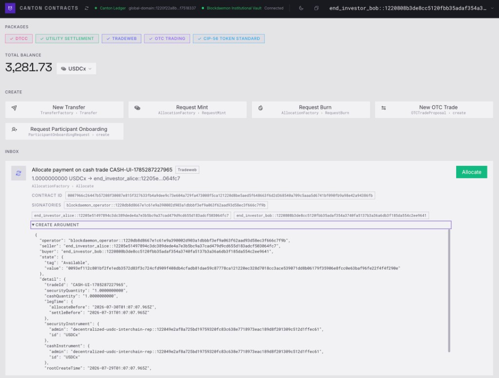 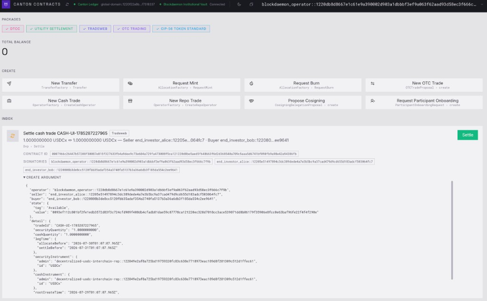
- Parties: buyer `end_investor_bob::1220808b…9641`, seller `end_investor_alice::12205e51…4fc7`, operator `blockdaemon_operator::1220db8d…7f9b`
- CCM shows packages including **CIP-56 TOKEN STANDARD**, Create actions (New Transfer, Request Mint/Burn, New Cash/Repo Trade), and Tradeweb inbox rows `AllocationFactory : Allocate` then `Dvp.Settle`

### Tokenization evidence (MintOffer)

Canton DevNet DTCC Offer Mint via Canton Contract Management:

- Update ID: `1220eec8991c9d2649495ade92ba521856dafae8b8688ac7a17cf1ee7b487a2e1b26`
- Explorer: https://lighthouse.devnet.cantonloop.com/transactions/1220eec8991c9d2649495ade92ba521856dafae8b8688ac7a17cf1ee7b487a2e1b26
- Screenshots: 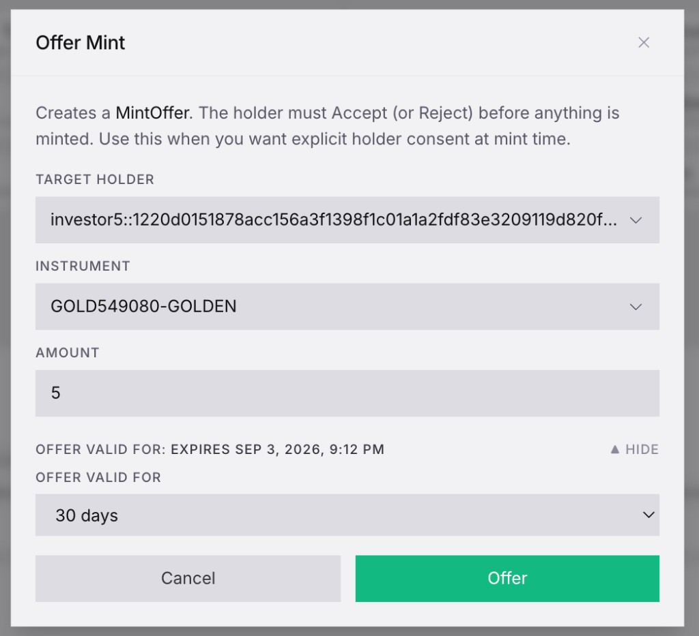 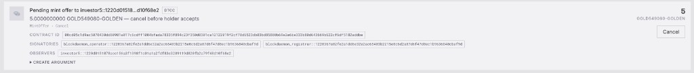
- Instrument `GOLD549080-GOLDEN`, amount `5`, target holder `investor5::1220d015…f68e2`; pending `MintOffer` (holder must Accept/Reject)

---

## CC support `cc_support`

> Send, receive, and hold Canton Coin.
>
> Suggested test: Send CC to and from the wallet. Record the transaction
> update IDs and optionally provide screenshots of the holding, transfer, and
> party ID.

- Transaction update ID(s): `12201036803aac784da83c291acb7fa91556a9cc2e8ed59d8e6af6c48ff96d3b4fb5`
- Party ID(s): source Vault account `treasuryvault1` (`bd::12209ff2…`); destination Vault account `payments1` (`bd::12200a90…`)
- Explorer link(s): https://lighthouse.devnet.cantonloop.com/transactions/12201036803aac784da83c291acb7fa91556a9cc2e8ed59d8e6af6c48ff96d3b4fb5
- Screenshot(s) / video: 
- Notes:
  - Canton DevNet transfer of 2 CC completed in Institutional Vault (status COMPLETED).
  - Public docs: [Canton Coin](https://vault.docs.blockdaemon.com/docs/canton); programmatic path [Make Transaction](https://vault.docs.blockdaemon.com/reference/cwpstartmaketransaction).

## Two-step CC transfers `two_step_cc_transfers`

> Perform a two-step CC transfer (propose/create followed by a separate
> accept/settle step, rather than a single atomic send).
>
> Suggested test: Perform a two-step CC transfer. Record the transaction
> update ID(s) for both steps and optionally provide screenshots of each.

- Transaction update ID(s): `1220057b6ae887f181cad0ef1a8c6d1ed10bf343be76bb034ccfc6ce092f6c94c838` (`TransferInstruction` Accept)
- Party ID(s): sender `bd::12209ff2c4cc8db3d1cd7a6716025098585bc1e4c497125137ce5f8a91cf03765e08`; receiver `endInvestor10::1220cfecdf6833fdec72a6356ff62c928ac346121bb5a55d3397871e186953855e41`
- Explorer link(s): https://lighthouse.devnet.cantonloop.com/transactions/1220057b6ae887f181cad0ef1a8c6d1ed10bf343be76bb034ccfc6ce092f6c94c838
- Screenshot(s) / video: 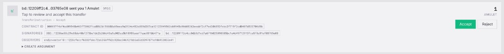
- Notes:
  - Canton DevNet two-step CC (Amulet) transfer: sender created a pending `TransferInstruction`; receiver accepted via CCM inbox (`TransferInstruction : Accept`, amount 1 Amulet).
  - Distinct from the one-step `TransferPreapproval_SendV2` path used under `preapprovals`.

## Pre-approvals for CC `preapprovals`

> Auto-accept incoming CC without manual confirmation. Distinct from
> registry_preapprovals (App Specific) below -- the two used to share an id
> but now have different suggested tests.
>
> Suggested test: Enable pre-approvals for CC. Send CC to the wallet address.
> Confirm the transfer was auto-accepted. Record the transaction update IDs
> and optionally provide screenshots of the holding, transfer, and party ID.

- Transaction update ID(s): `12201036803aac784da83c291acb7fa91556a9cc2e8ed59d8e6af6c48ff96d3b4fb5`
- Party ID(s): destination Vault account `payments1` (`bd::12200a90…`) held the transfer preapproval
- Explorer link(s): https://lighthouse.devnet.cantonloop.com/transactions/12201036803aac784da83c291acb7fa91556a9cc2e8ed59d8e6af6c48ff96d3b4fb5
- Screenshot(s) / video: 
- Notes:
  - Explorer shows choice `TransferPreapproval_SendV2` — CC send against an existing transfer preapproval (auto-accept path).
  - Public API to create the preapproval: [Canton Preapproval](https://vault.docs.blockdaemon.com/reference/cwpstartcantonpreapproval) (`POST /api/cwp/operations/start/cantonPreapproval`).

## CIP-0056 token standard transfer support `cip_0056_transfer`

> Send and receive any CIP-0056 token, not just CC.
>
> Suggested test: Send a CIP-0056-compatible token (not Canton Coin) to and
> from the wallet. Record the transaction update IDs and optionally provide
> screenshots of the holding, transfer, and party ID.

- Transaction update ID(s): `122065393eb072059af3f3a9c35341b50e5bc90070035cf7ffe6211f8e9d0a94ceac` (`TransferFactory_Transfer`; receiver later accepted via `TransferInstruction_Accept`)
- Party ID(s): sender `end_investor_bob::1220808b3de8cc5120fbb35adaf354a3740fa5137b3a36a6db3f185da554c2ee9641`; receiver `end_investor_alice::12205e51497894c3dc389dede4a7e3b5bc9a37cad479d9cd655d183adcf503064fc7`
- Explorer link(s): https://lighthouse.testnet.cantonloop.com/transactions/122065393eb072059af3f3a9c35341b50e5bc90070035cf7ffe6211f8e9d0a94ceac
- Screenshot(s) / video: 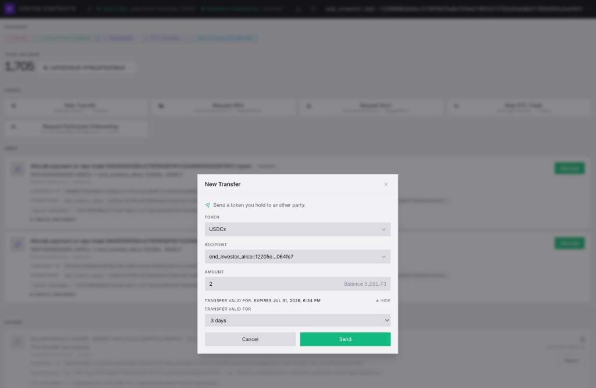 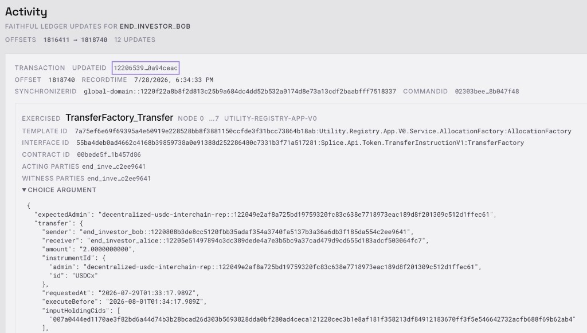 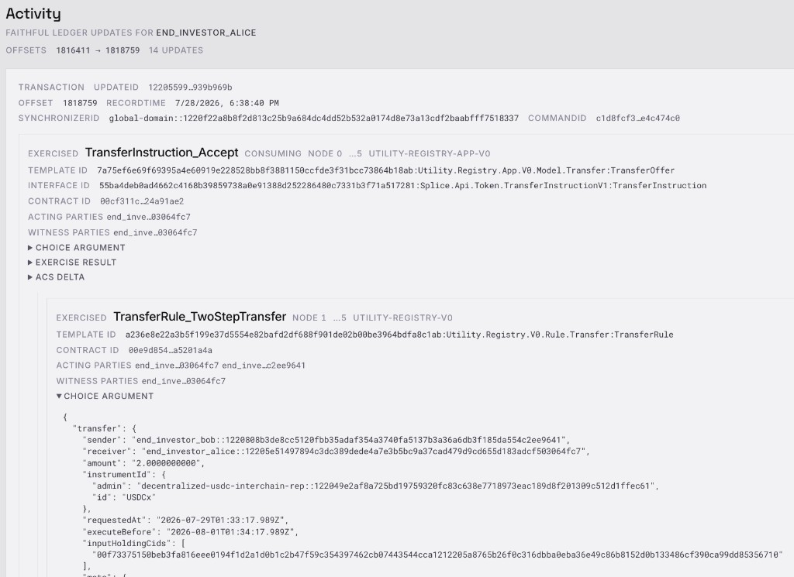
- Notes:
  - Canton Contract Management **New Transfer** of **2 USDCx** (CIP-56 utility token, not Canton Coin) from bob to alice on Canton TestNet.
  - On-ledger: `TransferFactory_Transfer` (TransferInstructionV1 / Utility Registry), then receiver `TransferInstruction_Accept` / `TransferRule_TwoStepTransfer`.
  - Instrument: USDCx (`decentralized-usdc-interchain-rep::122049e2…ffec61`).
  - Register API: [Add Canton CIP56 Token Asset](https://vault.docs.blockdaemon.com/reference/addblockchainsupportedasset).

## CIP-0056 token standard allocation support `cip_0056_allocation`

> Support for the allocation half of the CIP-0056 standard, distinct from
> plain transfers.
>
> Suggested test: Create and settle a CIP-0056 allocation (distinct from a
> plain transfer). Record the transaction update ID(s) for the allocation and
> its settlement, and optionally provide screenshots of the allocation before
> and after settlement.

- Transaction update ID(s):
  - Allocate: `122082fea90b55c88f9a23a42fd1acbbfbd394376ff33788104976065a973580b045`
  - Settle: `1220d626d21a6be4920c72c0801eb483fc1559192e835f3a04bd031519d21bf081d3`
- Party ID(s): `end_investor_bob::1220808b3de8cc5120fbb35adaf354a3740fa5137b3a36a6db3f185da554c2ee9641` (buyer / allocator); `end_investor_alice::12205e51497894c3dc389dede4a7e3b5bc9a37cad479d9cd655d183adcf503064fc7` (seller); `blockdaemon_operator::1220db8d8667e1c61e9a390002d903a1dbbbf3ef9a063f62aad93d58ec3f666c7f9b` (operator)
- Explorer link(s):
  - https://lighthouse.testnet.cantonloop.com/transactions/122082fea90b55c88f9a23a42fd1acbbfbd394376ff33788104976065a973580b045
  - https://lighthouse.testnet.cantonloop.com/transactions/1220d626d21a6be4920c72c0801eb483fc1559192e835f3a04bd031519d21bf081d3
- Screenshot(s) / video:  
- Notes:
  - Canton Contract Management (Tradeweb): allocate payment on cash trade `CASH-UI-1785287227965` via `AllocationFactory : Allocate` (1 USDCx), then operator `Dvp.Settle` (1 USDCx ↔ 1 USDCx).
  - Instrument: USDCx (`decentralized-usdc-interchain-rep::…` / CIP-56 token standard package enabled in CCM).
  - Public API also available: [Create Allocation](https://vault.docs.blockdaemon.com/reference/cwpstartcreateallocation).

## Memo tag support for transfers to omnibus accounts `memo_tag_support`

> Attach a memo tag to a transfer, recorded under the
> splice.lfdecentralizedtrust.org/reason metadata.
>
> Suggested test: Include a memo tag in an asset transfer (this can be
> combined with the cc_support test). Record the transaction update ID showing
> the memo tag under the splice.lfdecentralizedtrust.org/reason metadata in
> the transaction JSON.

- Transaction update ID(s): `12201036803aac784da83c291acb7fa91556a9cc2e8ed59d8e6af6c48ff96d3b4fb5`
- Party ID(s): source `treasuryvault1`; destination `payments1`
- Explorer link(s): https://lighthouse.devnet.cantonloop.com/transactions/12201036803aac784da83c291acb7fa91556a9cc2e8ed59d8e6af6c48ff96d3b4fb5
- Screenshot(s) / video: 
- Notes:
  - Vault UI shows **Canton Memo (On-chain):** `cc_support preapprovals memo_tag_support` for this completed transfer.
  - Public API field: [Make Transaction](https://vault.docs.blockdaemon.com/reference/cwpstartmaketransaction) optional `Canton.Reason` (`cwpCantonSpec.Reason`).
  - On-ledger metadata key: `splice.lfdecentralizedtrust.org/reason`.

## Wallet Connect support `walletconnect_support`

> Connect to and sign transactions from a third-party dApp via Wallet
> Connect.
>
> Suggested test: Connect to a dApp using Wallet Connect. Initiate a
> transaction from within the dApp and sign it from the wallet. Confirm the
> successful transaction. Optionally provide screenshots or a video
> recording.

- Transaction update ID(s): n/a (session and party-identity evidence; no dApp-initiated on-chain update attached)
- Party ID(s): `bd::122075956b920f8d6786f4872515e900d7920c19c5c57647d434fc62b5c5229913bf`
- Explorer link(s): n/a
- Screenshot(s) / video:
  - 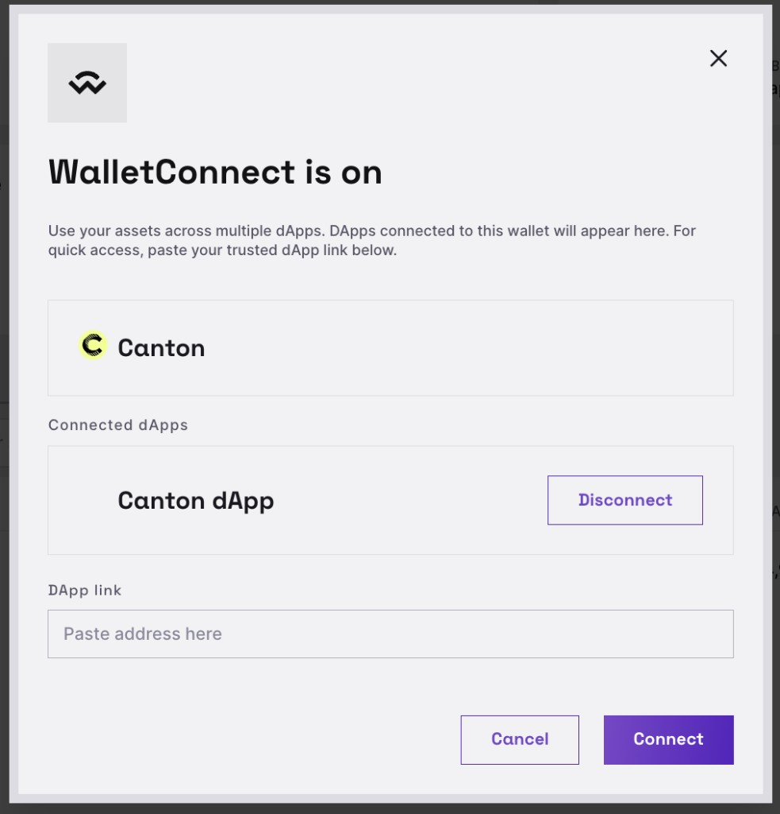
  - 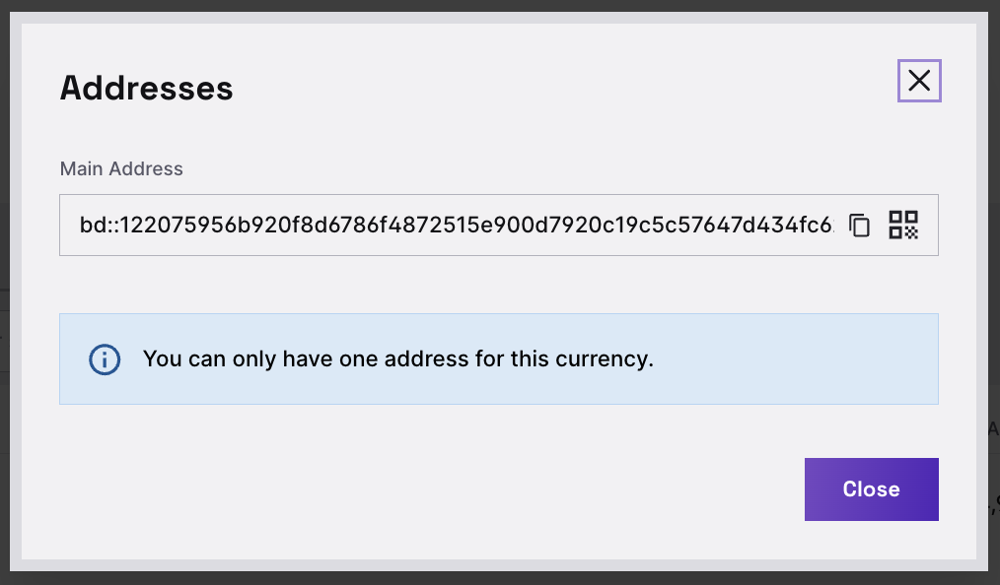
  - 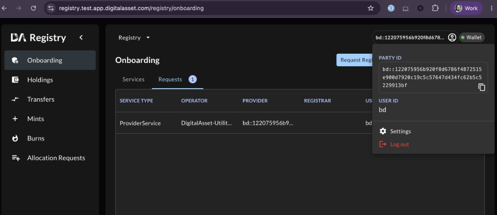
- Notes:
  - Institutional Vault UI shows **WalletConnect is on** for Canton, with connected dApp **Canton dApp**.
  - The same Vault Canton main address (`bd::122075956b9…`) is the DA Registry (Test) connected Wallet / Provider party (`registry.test.app.digitalasset.com/registry/onboarding`). DA Registry User ID: `bd`.
  - Public docs: [WalletConnect Usage](https://vault.docs.blockdaemon.com/docs/walletconnect-usage); Canton sessions on the same flow: [Institutional Vault Release v3.7.0](https://vault.docs.blockdaemon.com/changelog/institutional-vault-release-v370).

## Wallet Gateway signing driver `wallet_gateway_signing_driver`

> Integration with the Wallet Gateway signing driver.
>
> Suggested test: Integrate with the Wallet Gateway signing driver and
> demonstrate a signed transaction routed through it. Link to the signing
> driver. Record the transaction update ID and the Wallet Gateway
> request/session ID, and optionally provide a screenshot or log excerpt
> showing the driver handling the signing request.

- Transaction update ID(s): *(optional — live Gateway prepare → sign → execute session not attached)*
- Party ID(s): n/a (driver integration evidence)
- Explorer link(s): n/a
- Screenshot(s) / video: n/a
- Notes:
  - Public signing-driver source (Canton Network Wallet monorepo): [core/signing-blockdaemon/README.md](https://github.com/canton-network/wallet/blob/main/core/signing-blockdaemon/README.md)
  - Package `@canton-network/core-signing-blockdaemon` implements Wallet Gateway `SigningDriverInterface` (`BlockdaemonSigningDriver`) against Institutional Vault CWP Canton Signing API (`createKey`, `getKeys`, `signTransaction`, `getTransaction` / `getTransactions`).
  - Gateway env: `BLOCKDAEMON_API_URL` (defaults to `/api/cwp/canton`) and `BLOCKDAEMON_API_KEY`; register via `SigningProvider.BLOCKDAEMON`.

## Tokenization `tokenization`

> Tokenization capabilities the wallet supports.

- Transaction update ID(s):
  - MintOffer: `1220eec8991c9d2649495ade92ba521856dafae8b8688ac7a17cf1ee7b487a2e1b26`
  - Also DvP allocate/settle IDs under `cip_0056_allocation`
- Party ID(s): target holder `investor5::1220d0151878…f68e2`; signatories `blockdaemon_operator` / `blockdaemon_registrar`
- Explorer link(s): https://lighthouse.devnet.cantonloop.com/transactions/1220eec8991c9d2649495ade92ba521856dafae8b8688ac7a17cf1ee7b487a2e1b26
- Screenshot(s) / video:   (plus DvP allocate/settle screenshots under `cip_0056_allocation`)
- Notes:
  - Canton Contract Management **Offer Mint** creates a `MintOffer` for instrument `GOLD549080-GOLDEN` (amount 5); holder must Accept/Reject before mint (DTCC flow).
  - CCM also exposes Request Mint/Burn, CIP-56 transfers, and Tradeweb DvP allocate/settle.
  - [Institutional Vault Release v3.0.0](https://vault.docs.blockdaemon.com/changelog/institutional-vault-release-v300) — Canton tokenisation application.
  - Asset registration API: [Add Canton CIP56 Token Asset](https://vault.docs.blockdaemon.com/reference/addblockchainsupportedasset).

## Clear signing `clear_signing`

> The wallet displays human-readable transaction details (not raw hex/opaque
> data) before signing.
>
> Suggested test: Show the wallet displaying human-readable transaction
> details (not raw hex/opaque data) before signing. Provide a screenshot of
> the clear-signing confirmation screen for a real transaction, alongside its
> transaction update ID.

- Transaction update ID(s): `122082fea90b55c88f9a23a42fd1acbbfbd394376ff33788104976065a973580b045` (same allocate as `cip_0056_allocation`; ApproverApp showed this intent before MPC signing)
- Party ID(s): From `end_investor_bob` (internal); settlement executor `blockdaemon_operator::1220db8d…7f9b`
- Explorer link(s): https://lighthouse.testnet.cantonloop.com/transactions/122082fea90b55c88f9a23a42fd1acbbfbd394376ff33788104976065a973580b045
- Screenshot(s) / video: 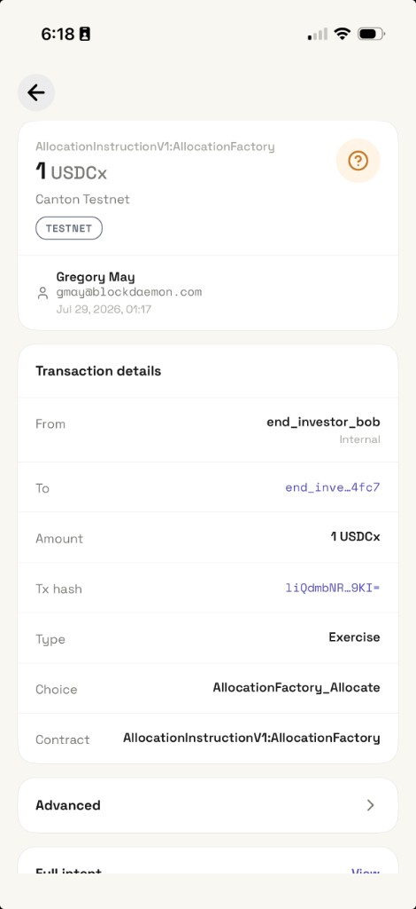 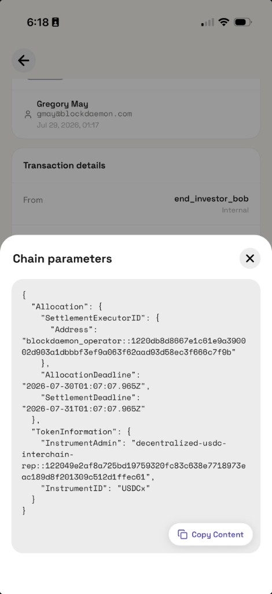
- Notes:
  - ApproverApp (Jul 29, 2026) presents human-readable fields before approval: amount `1 USDCx`, network Canton Testnet, From/To, Type `Exercise`, Choice `AllocationFactory_Allocate`, Contract `AllocationInstructionV1:AllocationFactory`, plus structured **Chain parameters** (Allocation deadlines, SettlementExecutorID, TokenInformation InstrumentAdmin/InstrumentID) — not raw hex.
  - Public docs: [Transaction and approval flows](https://vault.docs.blockdaemon.com/docs/transaction-flows); [Transaction Restrictions](https://vault.docs.blockdaemon.com/docs/transaction-restrictions).

---

## Self-attested features (no directory `proof:` field)

These features are `self_attested_only` in the Wallet Directory registry. Documented here for reviewers.

### Key recovery `key_recovery`

- [Emergency Recovery](https://vault.docs.blockdaemon.com/docs/emergency-recovery) — ERS break-glass process; Blockdaemon ships **`ertool`** (`recover pem` / `recover p11`, `derive`, `sign ecdsa-secp256k1` | `sign ed25519`), including Canton address derivation (`--address-type canton`).
- [Create ERS Encryption Key](https://vault.docs.blockdaemon.com/docs/create-ers-key) — generate the RSA ERS public key for install-time backup encryption.

### Policy workflows `policy_workflows`

- [Transaction Restrictions](https://vault.docs.blockdaemon.com/docs/transaction-restrictions) — configurable filters (asset, amount, source, destination, function, initiator group) with Approve or Block actions; covers transfers, raw signing, allocations, and related on-chain operations.
- Supporting overview: [Transaction and approval flows](https://vault.docs.blockdaemon.com/docs/transaction-flows).
