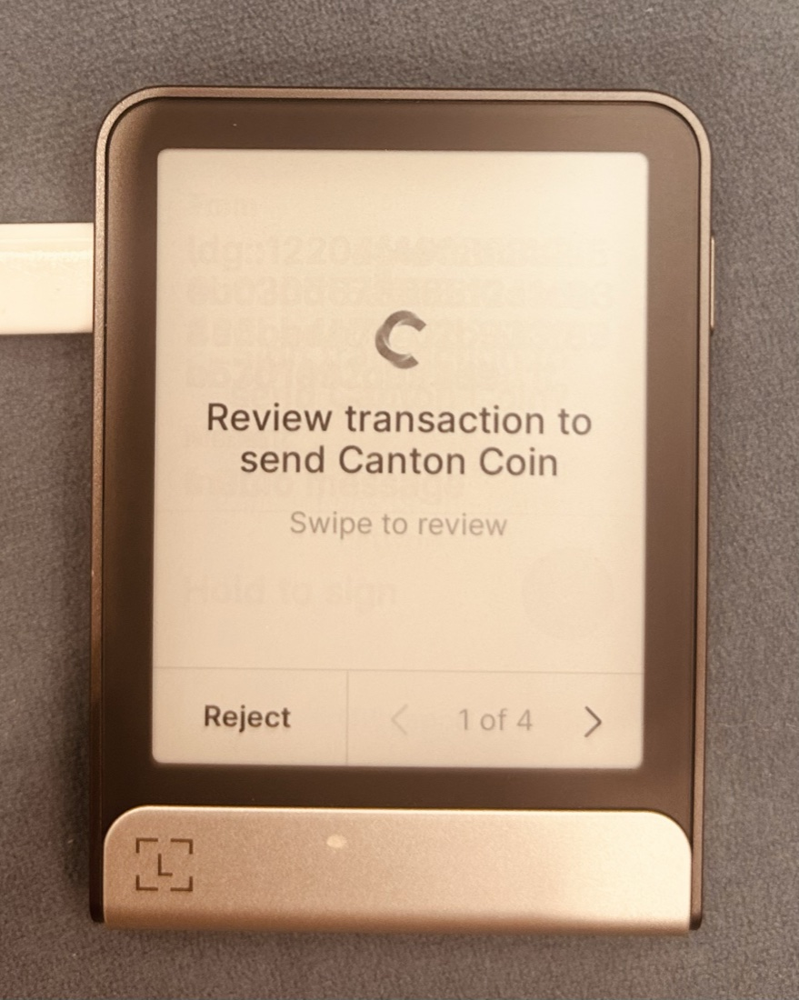
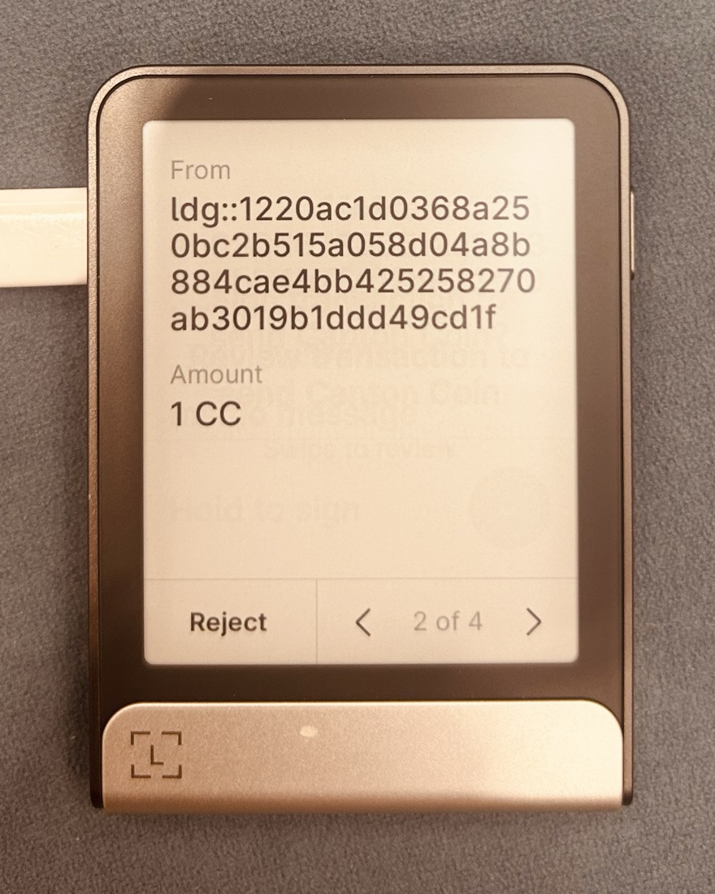
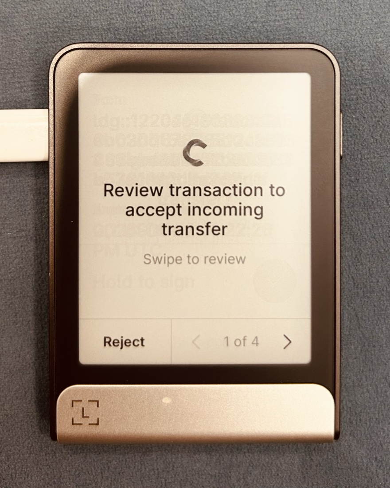
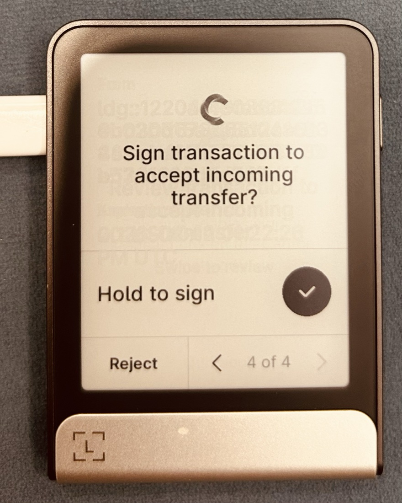
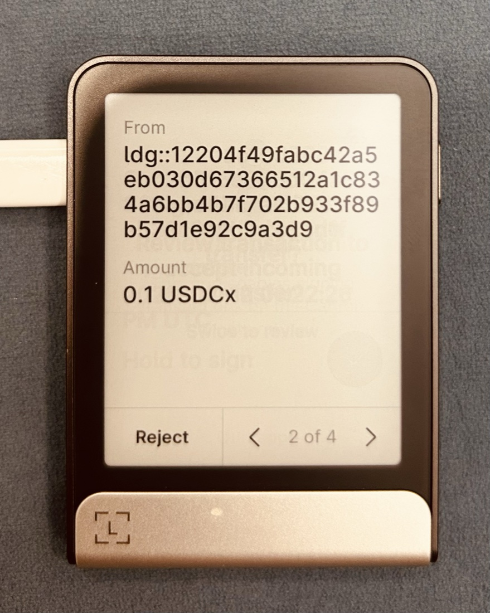
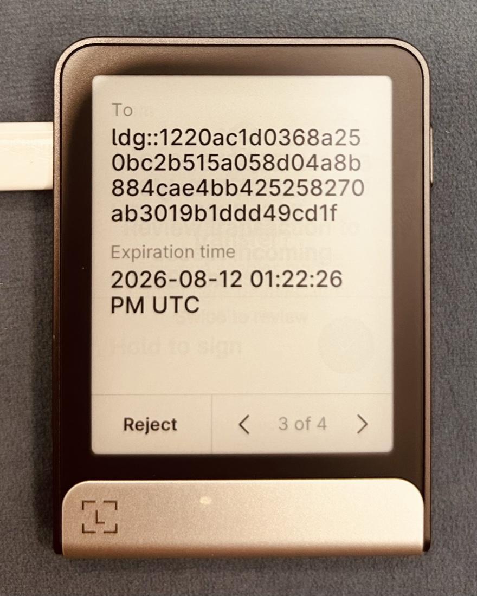
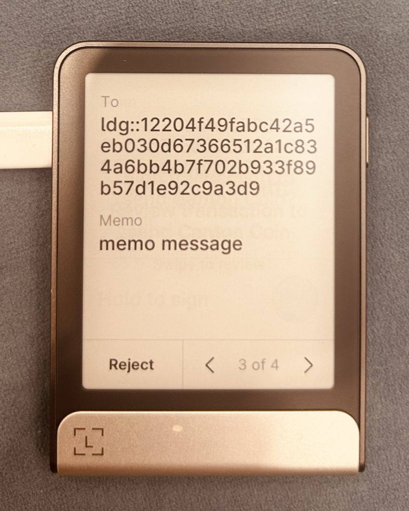
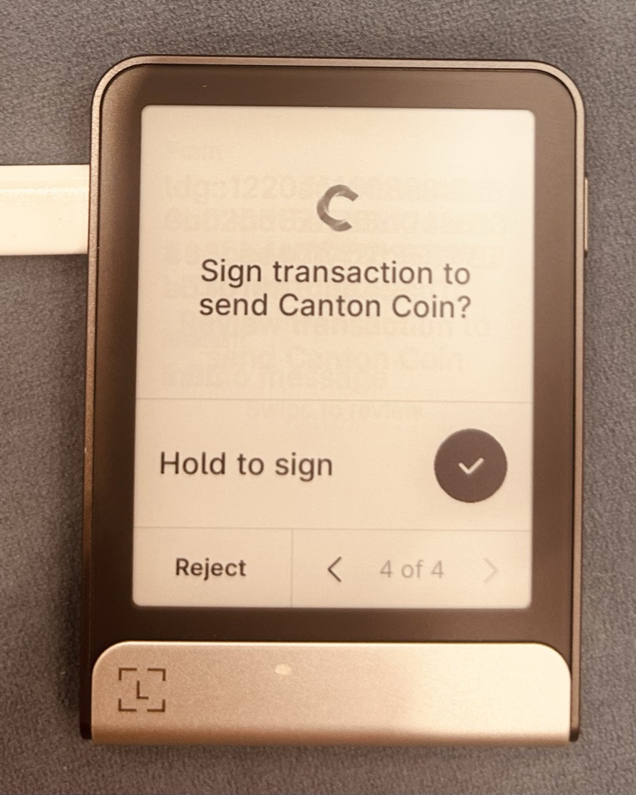

# Ledger Wallet — Self-Attestation Evidence

Wallet name: `ledger-wallet`
Last updated: 2026-08-10

Ledger Wallet is a self-custodial hardware wallet: a Ledger device running the
`app-canton` firmware, paired with the Ledger Wallet desktop and mobile apps. Canton
transactions are built by the wallet, signed on the Ledger device, and submitted through
Ledger's Canton gateway; the private key never leaves the device. Canton is live on
MainNet in the released Ledger Wallet. Every claim below is reproducible by a verifier on
MainNet using the registry's suggested test. Transaction update IDs for the on-chain
claims are included below (verifiable on the Cantonloop Lighthouse explorer), along with
on-device screenshots of the signing flow; any further evidence can be supplied on request.

The transactions below were performed with a Ledger Wallet account whose party ID is
`ldg::1220ac1d0368a250bc2b515a058d04a8b884cae4bb425258270ab3019b1ddd49cd1f`
([explorer](https://lighthouse.cantonloop.com/party/ldg%3A%3A1220ac1d0368a250bc2b515a058d04a8b884cae4bb425258270ab3019b1ddd49cd1f)).

---

## CC support `cc_support`

> Send, receive, and hold Canton Coin.
>
> Suggested test: Send CC to and from the wallet. Record the transaction update IDs and
> optionally provide screenshots of the holding, transfer, and party ID.

- Transaction update ID(s): `1220e74e07ebad44176b3a5e90448cc564791f2dbdc8b70ee7689f1283238fe4d470` (transfer proposal), `1220baf78f95c526ac7bfcedeafbb3193ea8073ac8edc6d7a5316e8a5df48adbca5c` (accept)
- Party ID(s): `ldg::1220ac1d0368a250bc2b515a058d04a8b884cae4bb425258270ab3019b1ddd49cd1f`
- Explorer link(s): https://lighthouse.cantonloop.com/transactions/1220e74e07ebad44176b3a5e90448cc564791f2dbdc8b70ee7689f1283238fe4d470 (proposal), https://lighthouse.cantonloop.com/transactions/1220baf78f95c526ac7bfcedeafbb3193ea8073ac8edc6d7a5316e8a5df48adbca5c (accept)
- Screenshot(s) / video: on-device review of the CC send —  
- Notes: Canton Coin is the `Amulet` instrument (symbol `CC`). Sending, receiving, and
  balances are available in the released Ledger Wallet on MainNet; every transaction is
  signed on the Ledger device. The transfer above settled via the two-step propose/accept
  flow.

## Two-step CC transfers `two_step_cc_transfers`

> Two-step CC transfer: propose/create followed by a separate accept/settle step, rather
> than a single atomic send.
>
> Suggested test: Perform a two-step CC transfer (propose/create followed by a separate
> accept/settle step, rather than a single atomic send). Record the transaction update
> ID(s) for both steps and optionally provide screenshots of each.

- Transaction update ID(s): `1220e74e07ebad44176b3a5e90448cc564791f2dbdc8b70ee7689f1283238fe4d470` (step 1 — propose), `1220baf78f95c526ac7bfcedeafbb3193ea8073ac8edc6d7a5316e8a5df48adbca5c` (step 2 — accept)
- Party ID(s): `ldg::1220ac1d0368a250bc2b515a058d04a8b884cae4bb425258270ab3019b1ddd49cd1f`
- Explorer link(s): https://lighthouse.cantonloop.com/transactions/1220e74e07ebad44176b3a5e90448cc564791f2dbdc8b70ee7689f1283238fe4d470 (step 1 — propose), https://lighthouse.cantonloop.com/transactions/1220baf78f95c526ac7bfcedeafbb3193ea8073ac8edc6d7a5316e8a5df48adbca5c (step 2 — accept)
- Screenshot(s) / video: the two steps on device — propose  and accept  
- Notes: The wallet proposes a transfer and separately accepts, rejects, or withdraws a
  pending transfer instruction; pending proposals are surfaced in the app for the user to
  act on. This propose/accept flow is the path Ledger Wallet uses today; the protocol's
  single-step auto-accept (pre-approval) is not enabled in the released wallet.

## CIP-0056 token standard transfer support `cip_0056_transfer`

> Send and receive any CIP-0056 token, not just Canton Coin.
>
> Suggested test: Send a CIP-0056-compatible token (not Canton Coin) to and from the
> wallet. Record the transaction update IDs and optionally provide screenshots of the
> holding, transfer, and party ID.

- Transaction update ID(s): `1220e24c7de83393f6656df0db4aeba411789ca5e2bb64a50770c1d13c362383c866` (USDC transfer proposal), `122016530b2abd8b3b14ca79ae84c1aa7fdd9f85fa5cf048d57ffcd33655ed27b35d` (accept)
- Party ID(s): `ldg::1220ac1d0368a250bc2b515a058d04a8b884cae4bb425258270ab3019b1ddd49cd1f`
- Explorer link(s): https://lighthouse.cantonloop.com/transactions/1220e24c7de83393f6656df0db4aeba411789ca5e2bb64a50770c1d13c362383c866 (proposal), https://lighthouse.cantonloop.com/transactions/122016530b2abd8b3b14ca79ae84c1aa7fdd9f85fa5cf048d57ffcd33655ed27b35d (accept)
- Screenshot(s) / video: on-device review of the USDC (CIP-0056) transfer —   
- Notes: The transfer above is USDC, a CIP-0056 token instrument (not Canton Coin). Non-CC
  CIP-0056 instruments are resolved from Ledger's asset list and transferred using the
  CIP-0056 token standard (instrument id / admin).

## Memo tag support for transfers to omnibus accounts `memo_tag_support`

> Attach a memo tag to a transfer, recorded under the
> `splice.lfdecentralizedtrust.org/reason` metadata.
>
> Suggested test: Include a memo tag in an asset transfer (this can be combined with the
> cc_support test). Record the transaction update ID showing the memo tag under the
> `splice.lfdecentralizedtrust.org/reason` metadata in the transaction JSON.

- Transaction update ID(s): `1220545f5234d52d7254ef8c565ee4a3847360122e92dc23fcaae4a8b2eec1abbefe` (transfer proposal), `1220217fe9e0d888e309ebba337ffae49dba000ff17e48c09214fbbfd7fcda8b2e68` (accept)
- Party ID(s): `ldg::1220ac1d0368a250bc2b515a058d04a8b884cae4bb425258270ab3019b1ddd49cd1f`
- Explorer link(s): https://lighthouse.cantonloop.com/transactions/1220545f5234d52d7254ef8c565ee4a3847360122e92dc23fcaae4a8b2eec1abbefe (proposal), https://lighthouse.cantonloop.com/transactions/1220217fe9e0d888e309ebba337ffae49dba000ff17e48c09214fbbfd7fcda8b2e68 (accept)
- Screenshot(s) / video: the memo shown on the device — 
- Notes: The memo is recorded under the `splice.lfdecentralizedtrust.org/reason` metadata
  key, per CIP-0056. The transfer above carried a memo tag.

## Hardware wallet support `hardware_wallet_support`

> Support for hardware signing devices.

- Transaction update ID(s): n/a — device signing capability (see the transactions in the sections above)
- Party ID(s): `ldg::1220ac1d0368a250bc2b515a058d04a8b884cae4bb425258270ab3019b1ddd49cd1f`
- Explorer link(s): https://lighthouse.cantonloop.com/transactions/1220e74e07ebad44176b3a5e90448cc564791f2dbdc8b70ee7689f1283238fe4d470 (CC send, hold-to-sign screenshot), https://lighthouse.cantonloop.com/transactions/122016530b2abd8b3b14ca79ae84c1aa7fdd9f85fa5cf048d57ffcd33655ed27b35d (accept, hold-to-sign screenshot)
- Screenshot(s) / video: on-device "Hold to sign" approval —  
- Notes: Ledger Wallet is itself the hardware signer.
  Supported devices: Ledger Nano X, Nano S+, Stax, Flex, and Apex.
  Keys are derived and held on-device (SLIP-10 Ed25519); the private key never leaves the device.

## Clear signing `clear_signing`

> The wallet displays human-readable transaction details (not raw hex/opaque data) before
> signing.
>
> Suggested test: Show the wallet displaying human-readable transaction details (not raw
> hex/opaque data) before signing. Provide a screenshot of the clear-signing confirmation
> screen for a real transaction, alongside its transaction update ID.

- Transaction update ID(s): `1220545f5234d52d7254ef8c565ee4a3847360122e92dc23fcaae4a8b2eec1abbefe` (the CC-with-memo transfer shown in the screenshots; see `memo_tag_support`)
- Party ID(s): `ldg::1220ac1d0368a250bc2b515a058d04a8b884cae4bb425258270ab3019b1ddd49cd1f`
- Explorer link(s): https://lighthouse.cantonloop.com/transactions/1220545f5234d52d7254ef8c565ee4a3847360122e92dc23fcaae4a8b2eec1abbefe
- Screenshot(s) / video: full decoded review flow on device —    
- Notes: The Ledger device shows decoded transaction fields before signing. Some
  transactions routed via the Featured-App-Proxy fall back to blind signing (the
  transaction hash).
