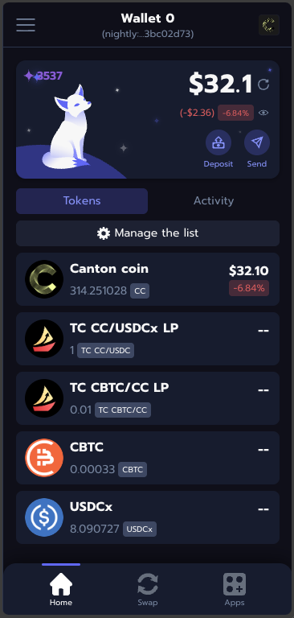
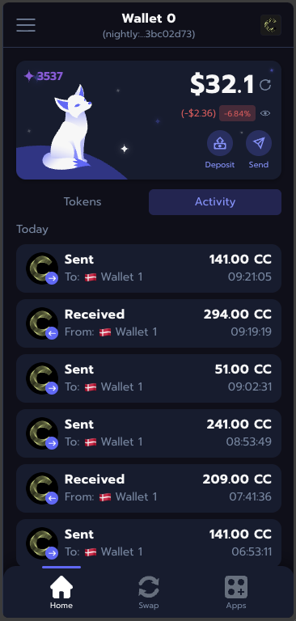

# Nightly — Self-Attestation Evidence

- Wallet: `nightly`
- Last updated: 2026-08-06

This submission is based on public Nightly product documentation, the open-source Canton integration, and the attached product screenshots and recordings.

## CC support `cc_support`

Nightly supports Canton Coin (CC) in the Canton wallet experience.

Evidence:

- [Nightly Canton wallet](https://nightly.app/wallet/canton)
- Screenshot: 
- Screenshot: 
- Video: [Canton send flow](./nightly-self-attestation-videos/canton-sent.mov)

## Two-step CC transfers `two_step_cc_transfers`

Nightly supports the two-step Canton Coin transfer flow.

Evidence:

- [Canton transaction commands](https://docs.nightly.app/docs/canton/canton/transaction_commands/)
- Video: [Canton send flow](./nightly-self-attestation-videos/canton-sent.mov)
- Video: [dApp connection and actions](./nightly-self-attestation-videos/dapp-connection-and-actions.mov)

## Memo tag support for transfers to omnibus accounts `memo_tag_support`

Nightly supports memo tags for transfers to omnibus accounts.

Evidence:

- [Nightly Canton wallet](https://nightly.app/wallet/canton)

## CIP-0103 dApp API support `cip_0103_dapp_api`

Nightly supports the CIP-0103 dApp API integration pattern.

Evidence:

- [Canton web3 template](https://github.com/nightly-labs/canton-web3-template/blob/main/README.md)
- [Canton adapter](https://github.com/nightly-labs/canton-web3-template/blob/main/app/misc/adapter.ts)
- Video: [dApp connection and actions](./nightly-self-attestation-videos/dapp-connection-and-actions.mov)
